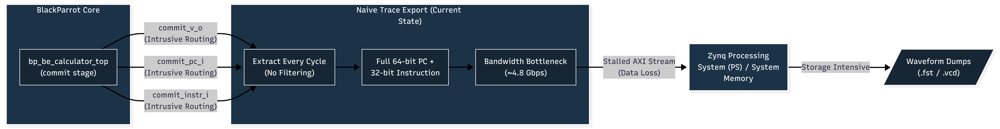
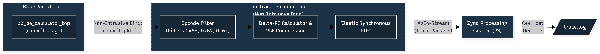

# ZynqParrot RISC-V Trace Encoder (PoC)

[]()
[]()
[]()
[]()

A cycle-accurate, standalone RISC-V hardware trace encoder prototype designed for non-intrusive integration into the **BlackParrot** (`bp_be_top`) backend pipeline. 

This repository serves as a proof-of-concept for compressing execution traces natively in hardware to overcome FPGA I/O bandwidth limitations when debugging soft-cores in the ZynqParrot environment.

## The Bandwidth Bottleneck
Hardware-level debugging on FPGA platforms is heavily restricted by bus bandwidth. Exporting the full 64-bit Program Counter (PC) and 32-bit instruction every clock cycle at 50 MHz generates **~4.8 Gbps of trace data**, severely stalling the Zynq Processing System (PS).

**The Solution:** Since linear execution (`PC + 4`) can be reconstructed offline using the compiled `.elf` binary, this encoder implements a hardware filter that exclusively captures non-linear control flow discontinuities. This reduces the required trace bandwidth by an estimated 80-90%.

## Architecture & Features
This prototype mirrors the exact interfaces found in the FOSSi `bp_common` repository to ensure seamless upstream integration.

## Before

## After


* **Non-Intrusive Tapping:** Intercepts the `bp_be_commit_pkt_s` retiring from the `bp_be_calculator_top` using SystemVerilog `bind` constructs, avoiding core RTL pollution.
* **RV64 Alignment:** Native support for 64-bit addresses, directly mimicking the official BlackParrot data structures.
* **Delta Filtering:** Combinational logic to suppress sequential PC updates and only trigger trace packets on pipeline discontinuities (Branches, JAL, JALR).
* **Variable Length Encoding (VLE):** Hardware dynamic compression that detects small jumps and strips up to 56 bits of zeros, replacing 64-bit targets with 8-bit offsets.
* **Elastic Backpressure:** Parameterized circular FIFO ring-buffer utilizing `valid/ready/yumi` handshakes to prevent trace data loss during instruction traffic jams.
* **Nexus 5001 Packetization:** Outputs structured 80-bit packets (`MCODE`, `Source ID`, `Timestamp`, `Payload`).

## Verification & Visuals
The simulation environment uses a cycle-accurate compiled C++ model via **Verilator**, matching industry-standard VLSI verification workflows.

### 1. Commit Stage Isolation
*GTKWave analysis demonstrating the successful isolation of the commit signals and opcode within the BlackParrot backend.*


### 2. Hardware Trace Filtering
*Verilator Co-Simulation output confirming the hardware successfully ignores linear ALU instructions and captures non-linear branches.*


## Quick Start (Local Simulation)

### Prerequisites
* `verilator` (Hardware simulation)
* `g++` (C++ Driver compilation)

### Build & Execute
To run the Verilator testbench and see the trace filter in action:

```bash
# 1. Clone the repository
git clone [https://github.com/RKNAGA18/zynq-parrot-trace-playground.git](https://github.com/RKNAGA18/zynq-parrot-trace-playground.git)
cd zynq-parrot-trace-playground

# 2. Build the Verilator model
make build.verilator

# 3. Execute the cycle-accurate simulation
make sim.verilator
